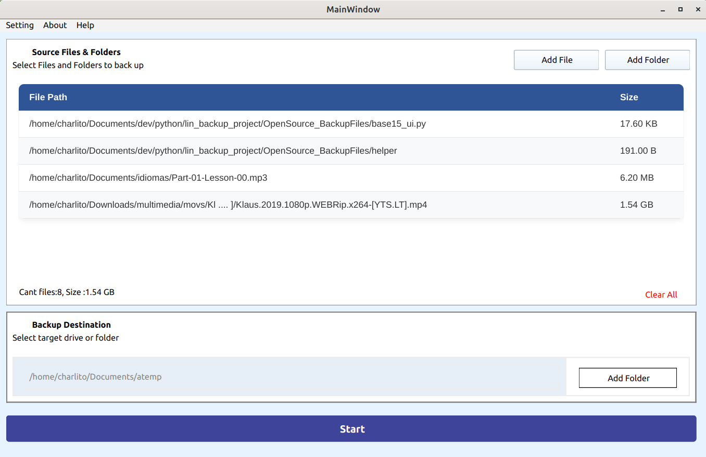

# OpenSource Backup Files

A simple desktop application for Linux that helps users select and copy files and folders to another location.

The project is being developed with Python and Qt. Its goal is to provide a clear interface for reviewing copied files, detecting conflicts, and deciding whether existing files should be overwritten or skipped.

## User interface



> Replace `docs/images/app-ui.png` with a screenshot of the application while keeping the same filename and folder structure.

## Current features

- Select individual files.
- Select folders.
- Display the selected paths in the interface.
- Store the selected paths for later processing.
- Shorten long paths for easier display.

## Planned features

- Select a destination folder.
- Prevent duplicate paths.
- Remove paths from the selection.
- Compare source and destination files.
- Display copied files and detected conflicts.
- Show information about both files when a conflict occurs.
- Allow users to overwrite or skip existing files.
- Display copy progress and a final summary.
- Run file copying in a secondary thread.
- Package the application for installation on Linux Mint.

## Technologies

- Python
- Qt
- Qt Creator
- Qt Designer

## Project status

This project is currently under development. The basic user interface and file/folder selection functionality are already implemented.

## Screenshot setup

Create the following folders in the project if they do not exist:

```text
docs/
└── images/
    └── app-ui.png
```

Then copy your screenshot to `docs/images/app-ui.png`. GitHub will display it automatically in this README.

## License

License information will be added later.
